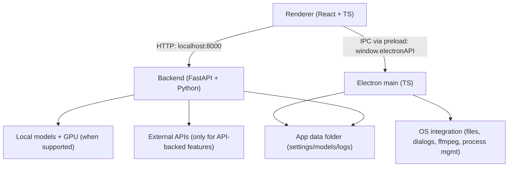

# LTX Desktop

LTX Desktop is an open-source desktop app for generating videos with LTX models — locally on supported Windows NVIDIA GPUs, with an API mode for unsupported hardware and macOS.

> **Status: Beta.** Expect breaking changes.
> Frontend architecture is under active refactor; large UI PRs may be declined for now (see [`CONTRIBUTING.md`](docs/CONTRIBUTING.md)).

## Windows WanGP Quick Start

Use one of these two setup paths for local WanGP-backed generation on Windows:

Before running any `pnpm` command, make sure `pnpm` is installed and available in `PATH`.

Prerequisites:

- Node.js 18+ from https://nodejs.org/
- `pnpm`, usually enabled with Corepack:

```bash
corepack enable
corepack prepare pnpm@latest --activate
pnpm -v
```

If `corepack` is unavailable but Node.js is already installed, you can install `pnpm` with:

```bash
npm install -g pnpm
pnpm -v
```

### 1. Wan2GP not installed yet

`pnpm setup:dev:win` clones `Wan2GP/` into this repository, installs the backend dependencies, and prepares a plug-and-play local setup.

```bash
pnpm setup:dev:win
pnpm dev
```

The desktop backend will prefer the repo-local checkout at `.\Wan2GP`.

### 2. Wan2GP already installed elsewhere

If you already have a working Wan2GP checkout and want LTX Desktop to reuse it, do not keep a local `.\Wan2GP` subfolder in this repo. Install only the LTX Desktop dependencies, then point `WANGP_ROOT` to the existing Wan2GP folder before starting the app.

```bash
pnpm install
cd backend
uv sync --extra dev
cd ..
pnpm dev
```

Set `WANGP_ROOT` to your existing Wan2GP folder before `pnpm dev`.

If both are present, LTX Desktop uses the local `.\Wan2GP` checkout first and falls back to `WANGP_ROOT` only when no local subfolder is available.

<p align="center">
  
</p>

<p align="center">
  
</p>

<p align="center">
  
</p>

## Features

- Text-to-video generation
- Image-to-video generation
- Audio-to-video generation
- Video edit generation (Retake)
- Video Editor Interface
- Video Editing Projects

## Local vs API mode

| Platform / hardware | Generation mode | Notes |
| --- | --- | --- |
| Windows + CUDA GPU with **≥32GB VRAM** | Local generation | Downloads model weights locally |
| Windows (no CUDA, <32GB VRAM, or unknown VRAM) | API-only | **LTX API key required** |
| macOS (Apple Silicon builds) | API-only | **LTX API key required** |
| Linux | Not officially supported | No official builds |

In API-only mode, available resolutions/durations may be limited to what the API supports.

## System requirements

### Windows (local generation)

- Windows 10/11 (x64)
- NVIDIA GPU with CUDA support and **≥32GB VRAM** (more is better)
- 16GB+ RAM (32GB recommended)
- Plenty of free disk space for model weights and outputs

### macOS (API-only)

- Apple Silicon (arm64)
- macOS 13+ (Ventura)
- Stable internet connection

## Install

1. Download the latest installer from GitHub Releases: [Releases](../../releases)
2. Install and launch **LTX Desktop**
3. Complete first-run setup

## First run & data locations

LTX Desktop stores app data (settings, models, logs) in:

- **Windows:** `%LOCALAPPDATA%\LTXDesktop\`
- **macOS:** `~/Library/Application Support/LTXDesktop/`

Model weights are downloaded into the `models/` subfolder (this can be large and may take time).

On first launch you may be prompted to review/accept model license terms (license text is fetched from Hugging Face; requires internet).

Text encoding: to generate videos you must configure text encoding:

- **LTX API key** (cloud text encoding) — **text encoding via the API is completely FREE** and highly recommended to speed up inference and save memory. Generate a free API key at the [LTX Console](https://console.ltx.video/). [Read more](https://ltx.io/model/model-blog/ltx-2-better-control-for-real-workflows).
- **Local Text Encoder** (extra download; enables fully-local operation on supported Windows hardware) — if you don't wish to generate an API key, you can encode text locally via the settings menu.

## API keys, cost, and privacy

### LTX API key

The LTX API is used for:

- **Cloud text encoding and prompt enhancement** — **FREE**; text encoding is highly recommended to speed up inference and save memory
- API-based video generations (required on macOS and on unsupported Windows hardware) — paid
- Retake — paid

An LTX API key is required in API-only mode, but optional on Windows local mode if you enable the Local Text Encoder.

Generate a FREE API key at the [LTX Console](https://console.ltx.video/). Text encoding is free; video generation API usage is paid. [Read more](https://ltx.io/model/model-blog/ltx-2-better-control-for-real-workflows).

When you use API-backed features, prompts and media inputs are sent to the API service. Your API key is stored locally in your app data folder — treat it like a secret.

### fal API key (optional)

Used for Z Image Turbo text-to-image generation in API mode. When enabled, image generation requests are sent to fal.ai.

Create an API key in the [fal dashboard](https://fal.ai/dashboard/keys).

### Gemini API key (optional)

Used for AI prompt suggestions. When enabled, prompt context and frames may be sent to Google Gemini.

## Architecture

LTX Desktop is split into three main layers:

- **Renderer (`frontend/`)**: TypeScript + React UI.
  - Calls the local backend over HTTP at `http://localhost:8000`.
  - Talks to Electron via the preload bridge (`window.electronAPI`).
- **Electron (`electron/`)**: TypeScript main process + preload.
  - Owns app lifecycle and OS integration (file dialogs, native export via ffmpeg, starting/managing the Python backend).
  - Security: renderer is sandboxed (`contextIsolation: true`, `nodeIntegration: false`).
- **Backend (`backend/`)**: Python + FastAPI local server.
  - Orchestrates generation, model downloads, and GPU execution.
  - Calls external APIs only when API-backed features are used.



## Development (quickstart)

Prereqs:

- Node.js
- `uv` (Python package manager)
- Python 3.12+
- Git

Setup:

```bash
# macOS
pnpm setup:dev:mac

# Windows
pnpm setup:dev:win
```

On Windows, `pnpm setup:dev:win` also clones `https://github.com/deepbeepmeep/Wan2GP` into the repo subfolder `Wan2GP/` and installs its Python dependencies into the backend venv so the desktop app can use the WanGP engine directly. That checkout remains usable on its own if you want to run Wan2GP from the subfolder.

Run:

```bash
pnpm dev
```

Debug:

```bash
pnpm dev:debug
```

`dev:debug` starts Electron with inspector enabled and starts the Python backend with `debugpy`.

Typecheck:

```bash
pnpm typecheck
```

Backend tests:

```bash
pnpm backend:test
```

Building installers:
- See [`INSTALLER.md`](docs/INSTALLER.md)

## Telemetry

LTX Desktop collects minimal, anonymous usage analytics (app version, platform, and a random installation ID) to help prioritize development. No personal information or generated content is collected. Analytics is enabled by default and can be disabled in **Settings > General > Anonymous Analytics**. See [`TELEMETRY.md`](docs/TELEMETRY.md) for details.

## Docs

- [`INSTALLER.md`](docs/INSTALLER.md) — building installers
- [`TELEMETRY.md`](docs/TELEMETRY.md) — telemetry and privacy
- [`backend/architecture.md`](backend/architecture.md) — backend architecture
- [`backend/WANGP_BACKEND.md`](backend/WANGP_BACKEND.md) — WanGP bridge configuration

## Contributing

See [`CONTRIBUTING.md`](docs/CONTRIBUTING.md).

## License

Apache-2.0 — see [`LICENSE.txt`](LICENSE.txt).

Third-party notices (including model licenses/terms): [`NOTICES.md`](NOTICES.md).

Model weights are downloaded separately and may be governed by additional licenses/terms.
